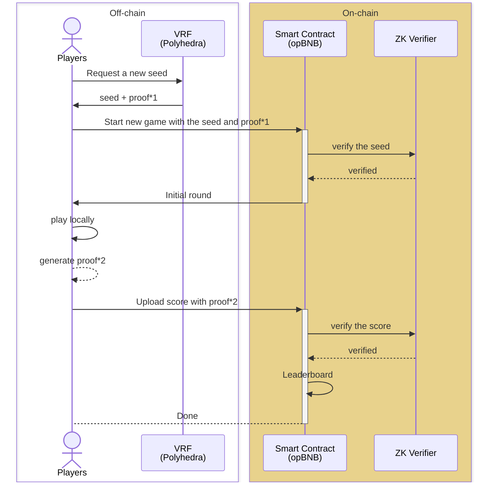

# Crypto Rumble :raised_hands: BNB Hackathon - Istanbul

- Please check out our [demo](https://test.zypher.game/CryptoRumble/) (you'll need to connect your crypto wallet with opBNB testnet gas :wink:)

- Contracts:
  - CryptoRumble: [`0x0Aa4135c7FD955A1421A238343D506Ff4BF656EC`](https://testnet.opbnbscan.com/address/0x0Aa4135c7FD955A1421A238343D506Ff4BF656EC)
  - GameHub: [`0x81186bD20f466c50D71B990B2a59621B020C7d9A`](https://testnet.opbnbscan.com/address/0x81186bD20f466c50D71B990B2a59621B020C7d9A)

- Git repositories:
  - [Web front-end](https://github.com/0xZG/crypto-rumble-frontend)
  - [Smart Contracts & ZK Circuits](https://github.com/0xZG/crypto-rumble-core)

### Dataflow:

